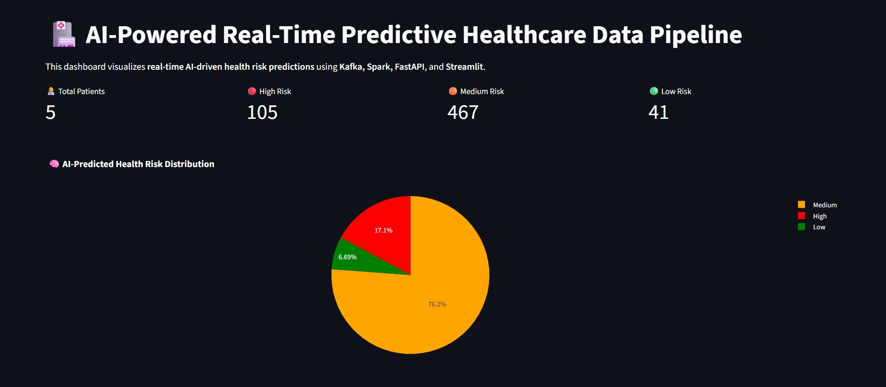

# 🌺 AI-Powered Predictive Healthcare Data Pipeline using Kafka and Spark

A real-time **AI-driven healthcare analytics pipeline** that continuously streams patient vital signs, processes them using **Apache Kafka** and **Apache Spark Structured Streaming**, predicts health risk levels (**High / Medium / Low**) using an **AI model (Random Forest)** served via **FastAPI**, and visualizes the results in a live **Streamlit dashboard**.

---

## 🚀 Overview

This project demonstrates how real-time healthcare data can be processed and analyzed using distributed technologies and AI.
It integrates a **streaming data pipeline** that ingests, processes, and predicts patient health risk in real time.

> 💡 The system simulates continuous patient vital streams, performs ETL (Extract–Transform–Load) using Spark, and applies a machine learning model to forecast health risks.

---

## 🧠 System Architecture

```
[Data Simulator] → [Kafka Producer] → [Kafka Topic: raw-patient]
                        ↓
                [Spark Structured Streaming ETL]
                        ↓
                [Cleaned Parquet Data Storage]
                        ↓
                  [FastAPI AI Model Server]
                        ↓
                [Streamlit Real-Time Dashboard]
```


---

## ⚙️ Tech Stack

| Layer           | Technology                                | Purpose                                 |
| --------------- | ----------------------------------------- | --------------------------------------- |
| Data Ingestion  | **Apache Kafka**                          | Real-time data streaming and messaging  |
| Data Processing | **Apache Spark (Structured Streaming)**   | ETL and stream computation              |
| Model Serving   | **FastAPI**                               | AI model API for health risk prediction |
| Dashboard       | **Streamlit + Plotly**                    | Live visualization of results           |
| ML Model        | **RandomForestClassifier (scikit-learn)** | Predicts risk level from vitals         |
| Language        | **Python 3.11+**                          | Core implementation                     |
| Storage         | **Parquet Files**                         | Cleaned streaming data storage          |

---

## 🧩 Key Features

✅ Real-time patient data streaming via Kafka
✅ Distributed data processing using Spark Structured Streaming
✅ AI-driven health risk classification (High / Medium / Low)
✅ FastAPI-based model serving
✅ Interactive Streamlit dashboard
✅ Automated start/stop scripts for full pipeline
✅ Modular, scalable, and production-ready architecture

---

## 🧪 Project Structure

```
AI_Powered_Healthcare_Pipeline/
│
├── data_ingestion/
│   └── data_simulator.py
│
├── spark_etl/
│   └── stream_processor.py
│
├── fastapi_server/
│   ├── app.py
│
├── models/
│   ├── model.pkl
│   ├── train_model.py
│
├── streamlit_dashboard/
│   └── dashboard.py
│
├── scripts/
│   ├── run_pipeline.bat
│   ├── stop_pipeline.bat
│
├── output/
│   └── cleaned_data/
│
├── requirements.txt
├── README.md
```

---

## 🛠️ Setup Instructions

### 1️⃣ Clone the repository

```bash
git clone https://github.com/YourUsername/AI_Powered_Healthcare_Pipeline.git
cd AI_Powered_Healthcare_Pipeline
```

### 2️⃣ Create and activate a virtual environment

```bash
python -m venv venv
venv\Scripts\activate
```

### 3️⃣ Install dependencies

```bash
pip install -r requirements.txt
```

### 4️⃣ Configure Kafka & Spark

* Install **Kafka 4.1.0 (KRaft Mode)** and **Spark 4.0.1**
* Set environment variables:

  ```
  SPARK_HOME=C:\tools\spark\spark-4.0.1-bin-hadoop3
  HADOOP_HOME=C:\tools\hadoop
  ```
* Add both to your **PATH**.

### 5️⃣ Run the entire pipeline

```bash
scripts\run_pipeline.bat
```

This script will:

1. Start Kafka
2. Start the Data Simulator
3. Start Spark Stream Processor
4. Start FastAPI Model Server
5. Start Streamlit Dashboard

### 6️⃣ Stop the pipeline

```bash
scripts\stop_pipeline.bat
```

---

## 📊 Outputs

| Component     | Output                                                 |
| ------------- | ------------------------------------------------------ |
| **Kafka**     | Topic `raw-patient` streams real-time vitals           |
| **Spark**     | Writes cleaned Parquet files to `/output/cleaned_data` |
| **FastAPI**   | `/predict_batch` endpoint serves AI predictions        |
| **Streamlit** | Live dashboard at `http://localhost:8501`              |

---

## 💡 AI Model Details

The AI module uses a **Random Forest Classifier** trained on simulated patient vital signs.

### 🔍 Features Used:

* Heart Rate
* Systolic BP
* Diastolic BP
* Oxygen Saturation
* Body Temperature
* Glucose Level

### 🎯 Output Labels:

* **High** → Critical condition
* **Medium** → Needs monitoring
* **Low** → Stable condition

---

## 📈 Sample Dashboard

A real-time Streamlit dashboard showing:

* Latest patient vitals
* AI-predicted health risk distribution pie chart
* High-risk patient alerts
* Auto-refresh every 5 seconds




---

## 🌍 Applications

* Real-time hospital patient monitoring
* IoT healthcare analytics
* ICU alert management
* Preventive health tracking and forecasting

---

## ⚠️ Limitations

* Uses **synthetic simulated data** (not real hospital data)
* Requires local Kafka and Spark setup
* Model accuracy depends on simulated dataset quality

---

## 🔮 Future Enhancements

* Integrate real hospital IoT datasets
* Deploy the pipeline on **AWS or GCP**
* Add time-series anomaly detection
* Implement real-time SMS/Email alerts for critical risks

---

## 👨‍💻 Author

**Madhab Patwari**
🎓 B.E. Computer Science & Engineering
📧 [[madhab2101pawtari@gmail.com]]
💼 [GitHub](https://github.com/Madhab2101) • [LinkedIn](https://linkedin.com/in/madhabpatwari)

> “Building scalable, intelligent, and data-driven healthcare systems for a smarter tomorrow.”
